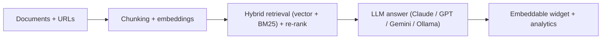

# AI Chatbot Builder Pro

**Build, train and embed RAG chatbots with hybrid retrieval, re-ranking and multi-provider LLMs, from a desktop app or an API.**

       



## Problem it solves

Businesses want chatbots that answer from their own documents, not generic model knowledge. This builder ingests documents and URLs, retrieves with dense plus BM25 search and re-ranking, and ships each bot as an embeddable widget with its own analytics.

A production-grade, full-stack AI chatbot builder with RAG (Retrieval-Augmented Generation), hybrid vector + BM25 search, re-ranking, and an embeddable widget system. Built with FastAPI, Flet (desktop UI), ChromaDB, and support for Anthropic, OpenAI, Gemini, and Ollama.

---

## Features

- **Multi-provider LLM support** — Anthropic Claude (default), OpenAI GPT-4o, Google Gemini, and local Ollama models
- **RAG pipeline** — hybrid dense + sparse (BM25) retrieval with cross-encoder re-ranking and multi-query expansion
- **Document ingestion** — PDF, DOCX, TXT, Markdown, HTML, CSV, JSON, and live URL crawling (with optional Playwright for JS-heavy sites)
- **Multiple chunking strategies** — recursive, token-based, and semantic sentence grouping
- **Embeddable widget** — generates a drop-in `<script>` tag or `<iframe>` to embed any chatbot on any website
- **Project isolation** — each chatbot project has its own vector collection, API keys, rate limits, and usage analytics
- **Streaming chat** — real-time Server-Sent Events (SSE) for both the desktop UI and embedded widgets
- **Analytics dashboard** — daily active users, token consumption, average response time, top questions
- **Desktop GUI** — Flet-based dark-theme UI for building, managing, and testing chatbots without touching the CLI
- **Docker Compose** — one-command deployment with PostgreSQL and optional Ollama sidecar

---

## Architecture

```
┌──────────────────────────────────────────────────────────┐
│                    Flet Desktop UI                        │
│  Dashboard │ Projects │ Analytics │ Settings │ Embed      │
└─────────────────────────┬────────────────────────────────┘
                          │ HTTP / SSE
┌─────────────────────────▼────────────────────────────────┐
│                  FastAPI (port 8000)                       │
│  /api/v1/projects  /api/v1/chat  /api/v1/documents        │
│  /api/v1/analytics  /api/v1/settings  /widget.js          │
└──────┬──────────────────┬──────────────────┬─────────────┘
       │                  │                  │
┌──────▼──────┐  ┌────────▼────────┐  ┌──────▼──────┐
│  SQLite /   │  │    ChromaDB     │  │  LLM APIs   │
│  PostgreSQL │  │  (vector store) │  │  Anthropic  │
│  (metadata) │  │  + BM25 index   │  │  OpenAI     │
└─────────────┘  └─────────────────┘  │  Gemini     │
                                       │  Ollama     │
                                       └─────────────┘
```

---

## Requirements

- Python 3.11+
- Node.js (optional, for testing the embed widget)
- Docker + Docker Compose (optional)

---

## Quick Start (Standalone)

### 1. Clone and set up the environment

```bash
git clone https://github.com/yourorg/ai-chatbot-builder-pro.git
cd ai-chatbot-builder-pro

python -m venv .venv
source .venv/bin/activate          # Windows: .venv\Scripts\activate
pip install -r requirements.txt
```

### 2. Install Playwright browsers (optional, for JS-heavy URL crawling)

```bash
playwright install chromium
```

### 3. Configure environment variables

```bash
cp .env.example .env
# Edit .env and add your API keys:
# ANTHROPIC_API_KEY=sk-ant-...
# OPENAI_API_KEY=sk-...
# GOOGLE_API_KEY=AIza...
```

### 4. Run the application

```bash
python main.py
```

This starts both the FastAPI server on port 8000 and the Flet desktop UI.

---

## Quick Start (Docker Compose)

### Full stack with PostgreSQL

```bash
cp .env.example .env
# Edit .env with your API keys and set:
# DATABASE_URL=postgresql+asyncpg://chatbot:chatbot@db:5432/chatbot_builder

docker compose up -d
```

### With Ollama (local LLMs)

```bash
docker compose --profile ollama up -d
```

The `ollama` profile starts an Ollama sidecar. Pull a model before using it:

```bash
docker compose exec ollama ollama pull llama3.2
```

### Environment variables (`.env.example`)

| Variable | Default | Description |
|---|---|---|
| `DATABASE_URL` | `sqlite+aiosqlite:///./data/chatbot_builder.db` | Database connection string |
| `SECRET_KEY` | auto-generated | JWT signing key |
| `ENCRYPTION_KEY` | auto-generated | Fernet key for encrypting API keys |
| `ANTHROPIC_API_KEY` | — | Anthropic API key |
| `OPENAI_API_KEY` | — | OpenAI API key |
| `GOOGLE_API_KEY` | — | Google Gemini API key |
| `OLLAMA_BASE_URL` | `http://localhost:11434` | Ollama server URL |
| `DEFAULT_LLM_PROVIDER` | `anthropic` | Default LLM provider |
| `DEFAULT_LLM_MODEL` | `claude-sonnet-4-6` | Default model |
| `CHROMA_PERSIST_DIR` | `./data/chroma` | ChromaDB storage path |
| `API_PORT` | `8000` | FastAPI port |
| `FLET_PORT` | `8550` | Flet web port |
| `LOG_LEVEL` | `INFO` | Logging level |
| `CORS_ORIGINS` | `*` | Comma-separated allowed origins |

---

## API Reference

All routes are prefixed with `/api/v1`. The server runs on `http://localhost:8000` by default.

### Health

| Method | Path | Description |
|---|---|---|
| `GET` | `/health` | Returns server status and DB connectivity |

**Response:**
```json
{
  "status": "ok",
  "version": "1.0.0",
  "db_connected": true,
  "chroma_connected": true
}
```

---

### Projects

| Method | Path | Description |
|---|---|---|
| `GET` | `/api/v1/projects` | List all projects |
| `POST` | `/api/v1/projects` | Create a new project |
| `GET` | `/api/v1/projects/{id}` | Get project details + stats |
| `PUT` | `/api/v1/projects/{id}` | Update project |
| `DELETE` | `/api/v1/projects/{id}` | Delete project and all data |
| `POST` | `/api/v1/projects/{id}/duplicate` | Clone a project |
| `GET` | `/api/v1/projects/{id}/export` | Export project as JSON |
| `POST` | `/api/v1/projects/import` | Import project from JSON |

**Create project body:**
```json
{
  "name": "My Support Bot",
  "description": "Customer support chatbot",
  "system_prompt": "You are a helpful support agent for Acme Corp.",
  "llm_provider": "anthropic",
  "llm_model": "claude-sonnet-4-6",
  "embedding_provider": "sentence_transformers",
  "embedding_model": "all-MiniLM-L6-v2",
  "model_config_data": {
    "provider": "anthropic",
    "model": "claude-sonnet-4-6",
    "temperature": 0.7,
    "max_tokens": 2048
  },
  "chunking_config_data": {
    "strategy": "recursive",
    "chunk_size": 1000,
    "chunk_overlap": 200
  }
}
```

---

### Documents

| Method | Path | Description |
|---|---|---|
| `GET` | `/api/v1/projects/{id}/documents` | List documents |
| `POST` | `/api/v1/projects/{id}/documents` | Upload a file (multipart/form-data) |
| `POST` | `/api/v1/projects/{id}/ingest-url` | Ingest a URL |
| `GET` | `/api/v1/projects/{id}/documents/{doc_id}` | Get document details |
| `DELETE` | `/api/v1/projects/{id}/documents/{doc_id}` | Delete document |
| `POST` | `/api/v1/projects/{id}/documents/{doc_id}/reprocess` | Reprocess a document |
| `GET` | `/api/v1/projects/{id}/documents/{doc_id}/chunks` | Paginated chunk list |

**Upload file:** `POST /api/v1/projects/{id}/documents` with `Content-Type: multipart/form-data`, field `file`.

**Ingest URL body:**
```json
{
  "url": "https://docs.example.com",
  "use_playwright": false,
  "max_depth": 1
}
```

---

### Embedding

| Method | Path | Description |
|---|---|---|
| `POST` | `/api/v1/projects/{id}/embed` | Start embedding background task |
| `GET` | `/api/v1/projects/{id}/embed/status` | Check embedding progress |
| `GET` | `/api/v1/projects/{id}/vector-stats` | ChromaDB collection stats |

---

### Chat

| Method | Path | Description |
|---|---|---|
| `POST` | `/api/v1/projects/{id}/chat/stream` | Streaming chat (SSE) |
| `GET` | `/api/v1/projects/{id}/conversations` | List conversations |
| `GET` | `/api/v1/projects/{id}/conversations/{conv_id}` | Get conversation with messages |
| `DELETE` | `/api/v1/projects/{id}/conversations/{conv_id}` | Delete conversation |
| `GET` | `/api/v1/projects/{id}/conversations/{conv_id}/export` | Export (`?format=json\|txt\|markdown`) |

**Chat request body:**
```json
{
  "message": "What is your return policy?",
  "conversation_id": null,
  "stream": true,
  "max_context_chunks": 5,
  "include_sources": true
}
```

**SSE stream format:**
```
data: {"type": "token", "content": "Our return"}
data: {"type": "token", "content": " policy is..."}
data: {"type": "sources", "sources": [...]}
data: {"type": "done", "conversation_id": "...", "tokens_input": 512, "tokens_output": 128}
```

---

### API Keys

| Method | Path | Description |
|---|---|---|
| `GET` | `/api/v1/projects/{id}/api-keys` | List API keys |
| `POST` | `/api/v1/projects/{id}/api-keys` | Create API key |
| `DELETE` | `/api/v1/projects/{id}/api-keys/{key_id}` | Revoke API key |

**Create API key body:**
```json
{
  "name": "Production Widget",
  "rate_limit_per_minute": 60,
  "rate_limit_per_day": 10000,
  "allowed_origins": ["https://mysite.com"],
  "expires_at": null
}
```

The response includes `raw_key` which is only shown once: `cbp_<40 random chars>`.

---

### Widget

| Method | Path | Description |
|---|---|---|
| `POST` | `/api/v1/projects/{id}/embed-widget` | Generate embed code |
| `GET` | `/api/v1/widget.js?project_id=...&api_key=...` | Serve widget JavaScript |

**Embed widget body (WidgetConfig):**
```json
{
  "primary_color": "#4f8cff",
  "background_color": "#1a1d27",
  "text_color": "#f1f5f9",
  "position": "bottom-right",
  "welcome_message": "Hi! How can I help you?",
  "placeholder_text": "Type a message...",
  "bot_name": "Assistant",
  "suggested_questions": ["What are your hours?", "How do I return an item?"],
  "show_sources": true,
  "width": 380,
  "height": 600
}
```

**Response:**
```json
{
  "script_tag": "<script src=\"http://localhost:8000/api/v1/widget.js?...\"></script>",
  "iframe_tag": "<iframe src=\"...\"></iframe>",
  "api_endpoint": "http://localhost:8000",
  "widget_config": { ... }
}
```

---

### Analytics

| Method | Path | Description |
|---|---|---|
| `GET` | `/api/v1/projects/{id}/analytics?days=30` | Get analytics data |
| `GET` | `/api/v1/projects/{id}/analytics/export?days=30` | Download CSV |

---

### Public Widget Endpoint (no auth required for valid API key header)

| Method | Path | Description |
|---|---|---|
| `POST` | `/api/v1/public/{id}/chat/stream` | Chat via embedded widget (requires `X-API-Key` header) |

---

### Settings

| Method | Path | Description |
|---|---|---|
| `GET` | `/api/v1/settings` | Get current settings (keys masked) |

---

## Running Tests

```bash
# All tests
pytest src/tests/ -v

# With coverage
pytest src/tests/ --cov=src --cov-report=html

# Specific module
pytest src/tests/test_document_processor.py -v
pytest src/tests/test_vector_store.py -v
pytest src/tests/test_chatbot_engine.py -v
pytest src/tests/test_api.py -v
```

---

## Project Structure

```
ai-chatbot-builder-pro/
├── main.py                     # Entry point
├── requirements.txt
├── Dockerfile
├── docker-compose.yml
├── .env.example
└── src/
    ├── config.py               # Pydantic Settings
    ├── database.py             # SQLAlchemy async engine
    ├── models.py               # ORM models
    ├── schemas.py              # Pydantic v2 schemas
    ├── api_server.py           # FastAPI app + all routes
    ├── chatbot_engine.py       # RAG pipeline + LLM providers
    ├── vector_store.py         # ChromaDB + BM25 hybrid search
    ├── document_processor.py   # File parsing + chunking
    ├── embed_generator.py      # Widget JS code generation
    ├── streaming.py            # SSE helpers
    ├── auth.py                 # JWT + API key + rate limiting
    ├── analytics.py            # Usage tracking
    ├── export.py               # Project/conversation export
    └── ui/
        ├── app.py              # Flet shell + routing
        ├── components.py       # Design tokens + widgets
        ├── dashboard.py        # Project list view
        ├── project_view.py     # Project editor + chat tester
        ├── embed_view.py       # Widget customization
        ├── analytics_view.py   # Analytics dashboard
        └── settings_view.py    # Global settings
```

---

## Screenshots

> _Run `python main.py` to launch the desktop UI._

| Dashboard | Project Editor | Analytics |
|---|---|---|
| _Project list with stats_ | _Document upload + chat test_ | _Charts + CSV export_ |

---

## License

MIT
